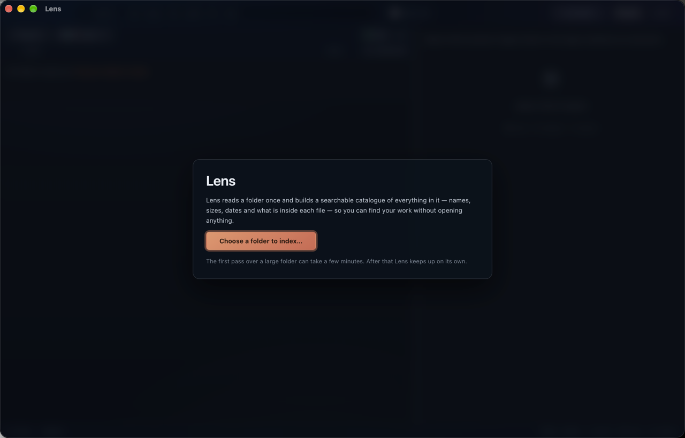
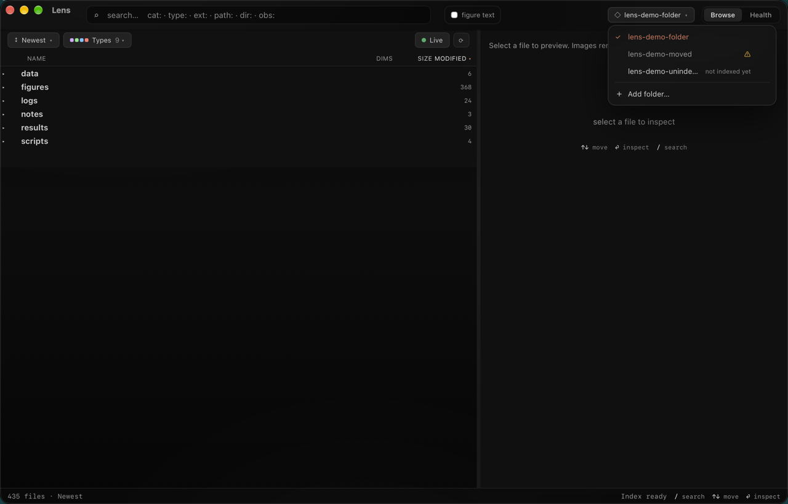
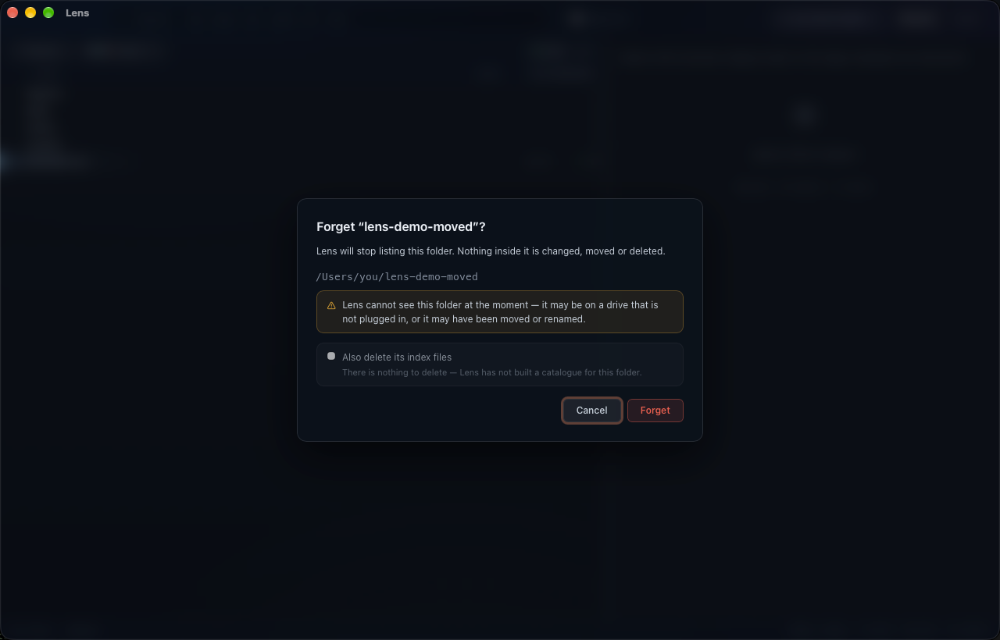
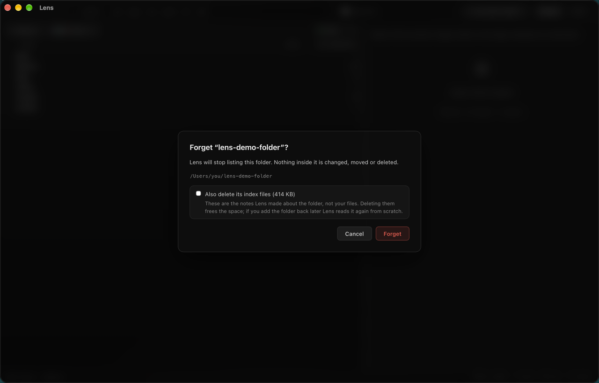

# Lens

Lens is a macOS app that turns a very large research folder into something you can search as fast as
you can type, giving a smoother experience than Finder.

- **Catalogues once, then answers from the catalogue.** One pass visits every file and records the elements that matter for search; every search after that reads the catalogue instead of the disk.
- **Nothing is copied, moved or altered.** The catalogue is written to a folder beside your data, and deleting it loses nothing else.
- **It keeps itself current.** A live watch indexes a new or changed file on its own, touching only that path — no full re-index. A forced re-index still only reads what actually changed.
- **Search reaches inside files, not just filenames.** Column and sheet names, single-cell annotations, function and class names — and, with one checkbox, the text drawn inside SVG figures, so a gene symbol on an axis label is findable even when it appears nowhere in the path.
- **The right pane previews what you land on.** PNG, SVG and markdown render in full; CSV, Excel and h5ad give their row × column counts and column names.
- **Act on a file without leaving the app** — copy its path, open it, reveal it in Finder, or, from a search result, locate it in the full folder tree.
- **Drag files out** to copy them to Finder, or drop them straight into another app.
- **Keyboard-driven throughout:** arrow keys to move, `/` to search, `esc` to clear.
- **A Health tab summarises the folder** — total files, total size, and how many symlinks there are and whether they resolve.
- **Known annoyance**: frequent and long writes to disk, such as a large data set, will cause the tree to refresh every couple seconds - the fix is to turn “Live” off, which freezes the index tree. Turn “Live” back on when the download is complete.

Every number below was measured against a real working folder of **113,444 files and 1.40 TB**.

---

## What gets searched

Lens builds **one line of text per file** and searches that line:

> **path** + **category, extension and reader** + **tags** + the **descriptors** read from the file

Descriptors come from a cheap read — a header, a footer, or one streaming pass — never a full load.
What that yields depends entirely on the type; **52.9% of files carry a descriptor beyond name, size
and date, and 47.1% do not.**

| File type | Read | Never read |
|---|---|---|
| `.h5ad` single-cell matrices | shape (cells × genes), storage format, numeric type, every per-cell and per-gene annotation name, embedding and layer names *(needs `h5py`)* | the matrix values |
| CSV / TSV / parquet | column names and the exact row count | any cell value |
| Excel `.xlsx` / `.xlsm` | every sheet's name, header row, column count and row count | any cell value |
| SVG figures | the words rendered inside the figure | — |
| Markdown | first heading, first paragraph | anything later |
| Python / R / shell | top-level function and class names, imports, first docstring line | function bodies |
| JSON / YAML / TOML | top-level keys, files under 5 MB only | nested keys, all values |
| Everything else (47.1% of files) | name, size, date | everything inside |

**Lens reads the names of things, never the values.** Column and sheet names, annotation names,
function and class names, top-level keys, a document's first heading — but never a spreadsheet cell,
a matrix value, a function body, or the prose of a document or PDF.

Column-name extraction can be switched off at index time. With it off, searching by column name
finds nothing until the folder is re-indexed with it back on.

**Figure text is opt-in and worth more than it looks.** Words drawn inside SVG figures live in their
own 3.95 MB store and join the search only when the **figure text** box is ticked. Measured on the
folder above: `HMGCR` returns **152** files by name, path and descriptors, and **133 further files**
carry it only as text inside a figure.

## How search works

**Plain substring, case-insensitive.** Typing `umap` matches anywhere in the line, mid-word included.
There is no typo tolerance, no wildcards, no regular expressions, no AND/OR, and accents are not
folded (`cafe` will not match `café`).

Results rank by how many words matched, then where (folder name ▸ file name ▸ path ▸ descriptors),
then whether the match fell on a word boundary, then your sort column. There is no relevance score.
Type and category filters combine with whatever you typed.

Two examples: `padj` finds the result tables whose column headers include it; `Braak` finds the
single-cell files carrying that annotation — neither file is opened.

---

## Install

1. Double-click `Lens.dmg` and drag **Lens** into **Applications**.
2. In Applications, **right-click Lens ▸ Open**, then click **Open** in the warning.
3. Double-click normally from then on.

Step 2 is required once. The app is not signed with a paid Apple Developer account, so macOS blocks
the first plain double-click. If macOS refuses even the right-click route, open **System Settings ▸
Privacy & Security**, scroll down, and use the button offering to open the blocked app.

## Requirements

**macOS only**, minimum 10.13. This is structural, not a gap: Lens uses macOS window effects, and
Reveal in Finder and Open are the system's own commands. The default build is universal (Apple
Silicon and Intel).

**Python 3.9 or newer.** The part that reads your files is a Python program bundled inside the app;
you supply the interpreter. Most Macs used for science already have one — Anaconda, Homebrew, or
python.org. Lens probes the usual locations, confirms the version by running it, and remembers what
worked. If it finds none it says so and offers **Choose Python…**; until then nothing can be indexed.
An environment variable named in that message forces a specific interpreter.

No Python packages are needed for the basic catalogue — the crawler uses only the standard library,
including its Excel reader. Three packages extend it:

```sh
python3 -m pip install h5py pyarrow
```

| Package | Unlocks | Without it |
|---|---|---|
| `h5py` | `.h5ad` and `.h5`: shape, storage format, numeric type, all annotation names, embedding and layer names | name, size and date only — **silently**, with no error shown |
| `pyarrow` | `.parquet`: column names with types, row count, row groups, from the footer | name, size and date only |
| `pyyaml` | more robust YAML | falls back to scanning unindented `key:` lines, which still finds top-level keys |

`.toml` needs Python **3.11 or newer**; on 3.9 or 3.10 those files yield nothing.

---

## First use

1. Open Lens and choose a folder.
2. Wait for the first pass — it opens the header of every file type it understands, so start it and
   do something else. Progress is reported throughout.

   **Measured:** the 1.40 TB, 113,444-file folder took **10 min 11 s** cold, over USB to an external
   SSD — about 186 files a second. A few thousand ordinary files finish in seconds. Your time tracks
   the number of files far more than the number of terabytes.
3. Re-indexing is cheap after that: the walk still visits everything, but a file is re-read only if
   its size or modified time changed.


*A fresh install has no folders and no preset path.*

**The window:** a fully collapsed folder tree on the left, a band of best matches above it once you
type, and a preview plus information panel on the right. Bottom-left counts what is in view against
the whole index. `/` jumps to search, `↑ ↓` move, `⏎` inspects.

**The catalogue** goes into `_repo_index` inside the folder you indexed. On the folder above the
database is **285 MB** — 0.02% of the data — and the whole folder, counting the exports written
beside it, about 846 MB. Deleting it loses the catalogue and nothing else.

**While Lens is open it watches the folder.** New, changed and deleted files appear by themselves.
**Live** parks that if a repaint is in your way, counting what waits and applying it all on release.
**⟳** re-scans from scratch, for when you suspect the catalogue has drifted.

## Managing your folders

The button at the top right lists every folder Lens knows and switches between them. One folder is
open at a time.


*Three states at a glance: a tick for the folder you are in; an amber ⚠ for one Lens cannot find —
moved, renamed, or on an unplugged drive; and a label for one never read.*

Hover a row for a **✕** at its right-hand end. It always asks first.


*Forgetting a folder Lens cannot find. Deleting the catalogue is greyed out with its reason — there
is none to delete.*


*For an indexed folder the same card offers to delete the catalogue and says how much that frees. Off
unless you tick it.*

Forgetting removes the folder from the list and nothing else — files are never touched and the
catalogue stays unless you ask for it. You can forget the folder you are viewing: Lens moves to
another, or returns to the opening screen if it was the last.

---

## Building from source

**Requirements:** macOS, **Node 22+**, and **Rust** from rustup.rs. The exact version Lens needs,
1.96.1, is pinned in the checkout and installs itself — a hard floor, since the bundled database
engine will not build on anything older.

```sh
./scripts/build-dmg.sh              # universal (Apple Silicon + Intel) — the default
./scripts/build-dmg.sh --native     # this Mac's architecture only; much faster, for testing
./scripts/build-dmg.sh --help
```

It checks the toolchain, installs either missing architecture, installs frontend dependencies,
builds, and copies the installer and app into `release/`, printing the path. The first build takes
several minutes; build output stays inside the repository and is git-ignored.

## Keeping it in sync with the research-repo copy

Lens is developed inside a larger research repository and released from this standalone one. Two
scripts move changes between them, **both dry runs by default** — they print what would change and
write nothing until you add `--apply`.

```sh
./scripts/sync-from-home.sh          # what would come IN from the research repo
./scripts/sync-to-home.sh            # what would go OUT to the research repo
```

Two guards: pulling in refuses to run if this repository has uncommitted changes, so it can be
undone; pushing out asks you to type `yes` and does not commit for you. Only the app and the crawler
are synced — this repository's documentation, scripts and build configuration are release-only. If
the research repository has moved, set the environment variable named in the scripts' error message.

## Where to read more

[`HOW_IT_WORKS.md`](HOW_IT_WORKS.md) — what the crawl visits and skips, what is recorded per file
type and where each capability stops, how search ranks, what updates by itself, what previews, and an
honest list of what is not built yet.
